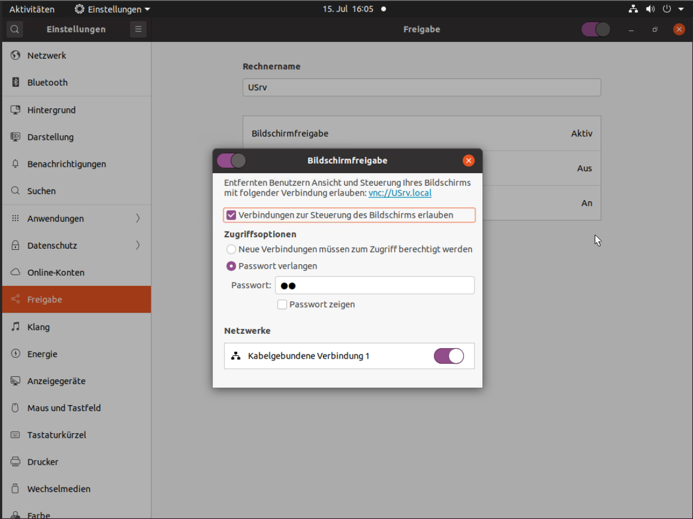

# Fisi_Linux

## noVNC unter Ubuntu 20.4 installieren

1. Unter Gnome / Einstellung / Freigabe / Bildschirmfreigabe:

2. Terminal:
   1. $ `gsettings set org.gnome.Vino require-encryption false`
   2. $ `sudo apt install novpn net-tools`
   3. $ `/usr/share/novnc/utils/launch.sh --vnc 0.0.0.0:5900`
3. Im Browser: `http://[IP]:6080/vnc.html?host=[hostname]&port=[6080]`
